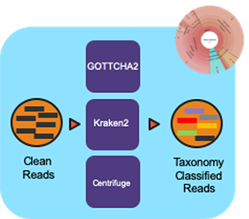

The Read-based Taxonomy Classification (v1.0.1)
================================================

Workflow Overview
-----------------
The pipeline takes in sequencing files (single- or paired-end) and profiles them using multiple taxonomic classification tools with the Cromwell as the workflow manager.

Workflow Availability
---------------------
The workflow is available in GitHub: https://github.com/microbiomedata/ReadbasedAnalysis; the corresponding Docker image is available in DockerHub: https://hub.docker.com/r/microbiomedata/nmdc_taxa_profilers

Requirements for Execution:  
~~~~~~~~~~~~~~~~~~~~~~~~~~~

(recommendations are in **bold**)

- WDL-capable Workflow Execution Tool (**Cromwell**)
- Container Runtime that can load Docker images (**Docker v2.1.0.3 or higher**)

Hardware Requirements:
~~~~~~~~~~~~~~~~~~~~~~
- Disk space: 152 GB for databases (55 GB, 89 GB, and 8 GB for GOTTCHA2, Kraken2 and Centrifuge databases, respectively)
- 60 GB RAM

Workflow Dependencies
---------------------

Third party software:
~~~~~~~~~~~~~~~~~~~~~

(These are included in the Docker image.)

- `GOTTCHA2 v2.1.6 <https://github.com/poeli/GOTTCHA2>`_  (License: `BSD-3-Clause-LANL <https://github.com/poeli/GOTTCHA2/blob/master/LICENSE>`_)
- `Kraken2 v2.0.8 <http://ccb.jhu.edu/software/kraken2>`_ (License: `MIT <https://github.com/DerrickWood/kraken2/blob/master/LICENSE>`_)
- `Centrifuge v1.0.4 <http://www.ccb.jhu.edu/software/centrifuge>`_ (License: `GPL-3 <https://github.com/DaehwanKimLab/centrifuge/blob/master/LICENSE>`_)

Requisite databases:
~~~~~~~~~~~~~~~~~~~~

The database for each tool must be downloaded and installed. These databases total 152 GB.

- GOTTCHA2 database (gottcha2/):

The database RefSeqr90.cg.BacteriaArchaeaViruses.species.fna contains complete genomes of bacteria, archaea and viruses from RefSeq Release 90. The following commands will download the database:

::

    wget https://edge-dl.lanl.gov/GOTTCHA2/RefSeq-r90.cg.BacteriaArchaeaViruses.species.tar
    tar -xvf RefSeq-r90.cg.BacteriaArchaeaViruses.species.tar
    rm RefSeq-r90.cg.BacteriaArchaeaViruses.species.tar

- Kraken2 database (kraken2/):

This is a standard Kraken 2 database, built from NCBI RefSeq genomes. The following commands will download the database:

::

    mkdir kraken2
    wget https://genome-idx.s3.amazonaws.com/kraken/k2_standard_20201202.tar.gz
    tar -xzvf k2_standard_20201202.tar.gz -C kraken2
    rm k2_standard_20201202.tar.gz

- Centrifuge database (centrifuge/):

This is a compressed database built from RefSeq genomes of Bacteria and Archaea. The following commands will download the database:

::

    mkdir centrifuge
    wget https://genome-idx.s3.amazonaws.com/centrifuge/p_compressed_2018_4_15.tar.gz 
    tar -xzvf p_compressed_2018_4_15.tar.gz -C centrifuge
    rm p_compressed_2018_4_15.tar.gz

Sample dataset(s):
~~~~~~~~~~~~~~~~~~

Zymobiomics mock-community DNA control (SRR7877884); this dataset is ~7 GB.

Input: A JSON file containing the following information:
1. selection of profiling tools (set as true if selected)
2. the paths to the required database(s) for the tools selected 
3. the paths to the input fastq file(s) (paired-end data is shown; this can be the output of the Reads QC workflow in interleaved format which will be treated as single-end data.)
4. the prefix for the output file names
5. the path of the output directory
6. CPU number requested for the run.

.. code-block:: JSON

    {
        "ReadbasedAnalysis.enabled_tools": {
            "gottcha2": true,
            "kraken2": true,
            "centrifuge": true
        },
        "ReadbasedAnalysis.db": {
            "gottcha2": "/path/to/database/RefSeq-r90.cg.BacteriaArchaeaViruses.species.fna",
            "kraken2": " /path/to/kraken2",
            "centrifuge": "/path/to/centrifuge/p_compressed"
        },
        "ReadbasedAnalysis.reads": [
            "/path/to/SRR7877884.1.fastq.gz",
            "/path/to/SRR7877884.2.fastq.gz"
        ],
        "ReadbasedAnalysis.paired": true,
        "ReadbasedAnalysis.prefix": "SRR7877884",
        "ReadbasedAnalysis.outdir": "/path/to/ReadbasedAnalysis",
        "ReadbasedAnalysis.cpu": 4
    }

Output:
~~~~~~~

The workflow creates an output JSON file and individual output sub-directories for each tool which include tabular classification results, a tabular report, and a Krona plot (html).::

    ReadbasedAnalysis/
    |-- SRR7877884.json
    |-- centrifuge
    |   |-- SRR7877884.classification.tsv
    |   |-- SRR7877884.report.tsv
    |   `-- SRR7877884.krona.html
    |   
    |-- gottcha2
    |   |-- SRR7877884.full.tsv
    |   |-- SRR7877884.krona.html
    |   `-- SRR7877884.tsv
    |   
    `-- kraken2
        |-- SRR7877884.classification.tsv
        |-- SRR7877884.krona.html
        `-- SRR7877884.report.tsv

Below is an example of the output directory files with descriptions to the right.

========================================  ==============================================
FileName                                  Description
----------------------------------------  ----------------------------------------------
SRR7877884.json	                          ReadbasedAnalysis result JSON file
centrifuge/SRR7877884.classification.tsv  Centrifuge output read classification TSV file
centrifuge/SRR7877884.report.tsv          Centrifuge output report TSV file
centrifuge/SRR7877884.krona.html          Centrifuge krona plot HTML file
gottcha2/SRR7877884.full.tsv              GOTTCHA2 detail output TSV file
gottcha2/SRR7877884.tsv                   GOTTCHA2 output report TSV file
gottcha2/SRR7877884.krona.html            GOTTCHA2 krona plot HTML file
kraken2/SRR7877884.classification.tsv     Kraken2 output read classification TSV file
kraken2/SRR7877884.report.tsv             Kraken2 output report TSV file
kraken2/SRR7877884.krona.html             Kraken2 krona plot HTML file
========================================  ==============================================

Version History
---------------

1.0.1 (release date 01/14/2021; previous versions: 1.0.0)

Point of contact
----------------

Package maintainer: Po-E Li <po-e@lanl.gov>
